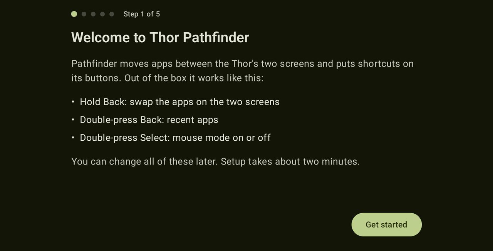
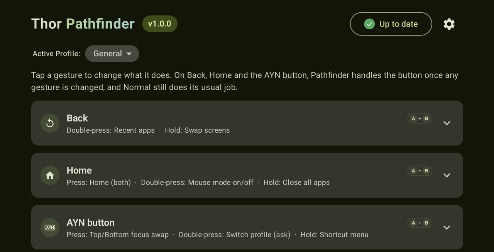
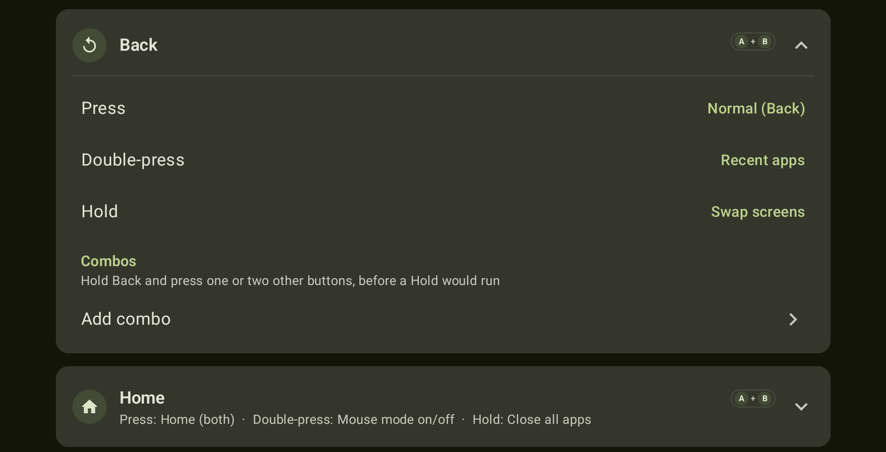
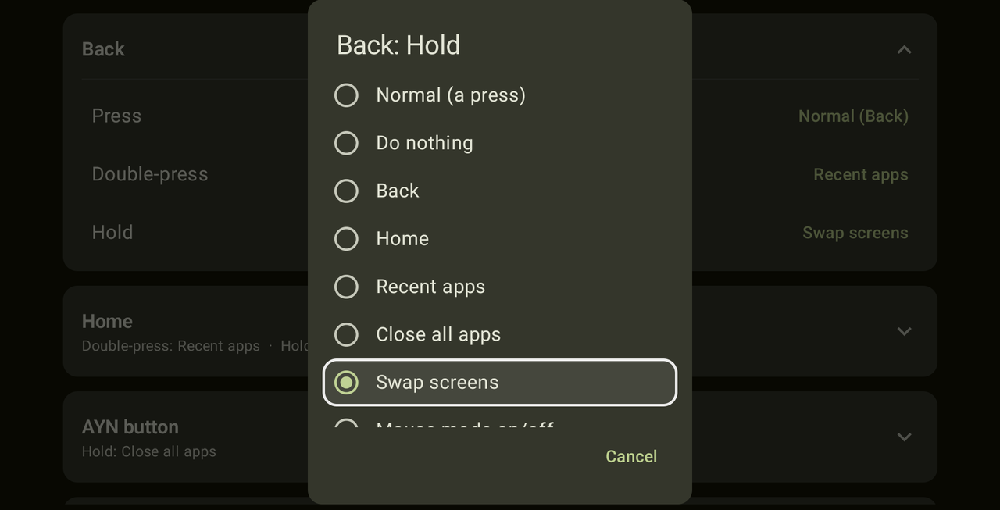
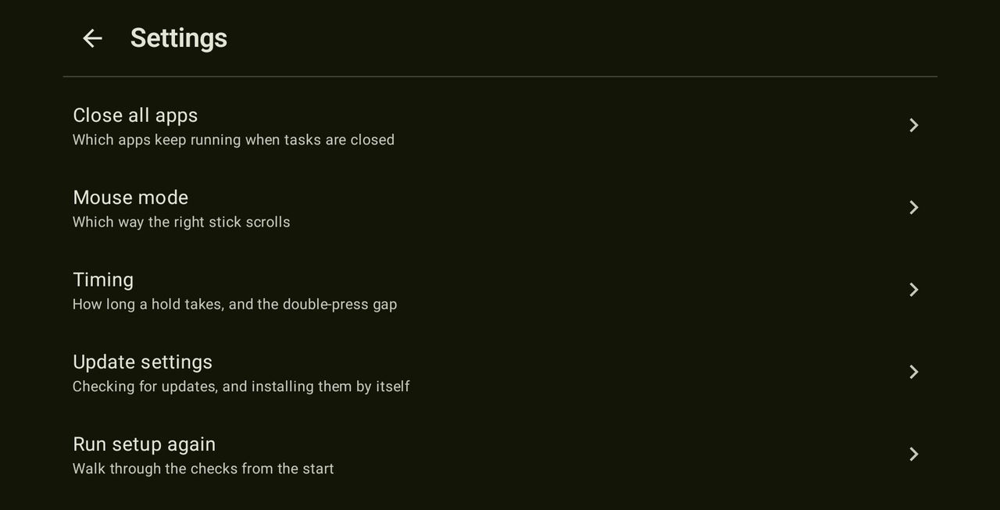
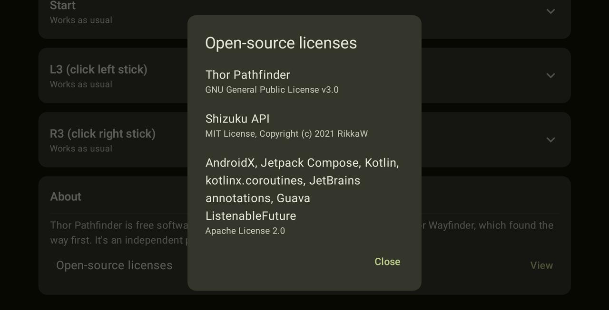

# 🧭 Thor Pathfinder

[](https://github.com/KaitonGxx/thor-pathfinder/releases/latest)
[](LICENSE)
[](#requirements)

Move apps between the AYN Thor's two screens, and put shortcuts on its buttons.

Pathfinder is a free, open-source companion for the AYN Thor. Hold Back and the
apps on the top and bottom screens trade places. Double-press Select and the
Thor's mouse mode turns on or off. Every shortcut can be changed, on seven of
the Thor's buttons.

It's made in the spirit of [Thor Wayfinder](https://github.com/Thor-Wayfinder/thor-wayfinder),
which found the way first, and covers everything Wayfinder does. It's an
independent project, not affiliated with Wayfinder or AYN.

> **AI disclosure:** Thor Pathfinder was written with Claude, Anthropic's AI
> assistant, under the direction of its maintainer, who tested the changes on
> an AYN Thor.

## 📸 Screenshots

| Setup | Main menu |
|:---:|:---:|
|  |  |
| **Button shortcuts** | **Choosing a shortcut** |
|  |  |
| **Settings** | **Open-source licenses** |
|  |  |

## ✨ Features

**🔀 Swap screens**
- Swaps the apps on the two screens, or sends a lone app to the other screen.
- Apps keep running while they move. Pathfinder hands the app's window to the
  other screen instead of restarting the app there.
- When a lone app leaves a screen, that screen goes to its home screen rather
  than revealing whatever was underneath.
- If one of the two apps is playing a video or music, it moves first, so
  playback stays smooth.

**🎮 Button shortcuts** on Back, Home, the AYN button, Select, Start, L3 and R3:
- Back, Home and the AYN button: press, double-press and hold.
- Select, Start, L3 and R3: double-press and hold. Games still receive every
  press of these buttons, so a plain press stays with the game.
- Actions: swap screens, mouse mode on/off, back, home, recent apps, close all
  apps, notifications, quick settings, screenshot, screen record (testing),
  power menu, lock screen, or open an app.
- Open an app on the top screen, the bottom one, or ask each time. Or open two
  at once, one on each screen.
- Home can go to the top screen, the bottom one, or both at once.
- Close all apps can spare the apps you choose: their window closes with the
  rest, but they aren't force-stopped, so music or a download carries on.
  Background helpers like OdinTools, ClusterTune and Pulse are offered first.

**🖱️ Mouse mode**

*Before:* mouse mode was switched only with the Thor's own switch, and the
right stick scrolled backwards. The stick drags an invisible finger across the
screen, so pushing up moved the page down. The Thor can reverse that, but
there's no button for it in its menus.

*With Pathfinder:*
- Double-press Select, or any shortcut you pick, to turn mouse mode on or off.
  A short message says which.
- One switch, under the cog's Mouse mode page, reverses the right stick, so
  pushing up scrolls up, like a mouse wheel. It takes effect after a restart,
  and Pathfinder offers a Restart now button.
- Cursor speed and sensitivity stay in the Thor's own mouse mode settings.

**🕹️ Built for the Thor**
- A step-by-step setup that checks each requirement before moving on.
- The cog at the top opens a settings menu: which apps keep running, mouse
  mode, the hold and double-press timings, updates, and running setup again.
- When something needs attention, it says why. Android switches accessibility
  services off whenever their app updates, and Shizuku stops when the Thor
  restarts.
- Works with the Thor's controller as well as touch. Every control shows a
  clear outline when it has focus.
- Pathfinder looks for a newer release when it opens, and the button at the
  top says what it found. A new version brings up a notice you can dismiss,
  for now or for good.
- If you turn it on, Pathfinder installs an update itself: it fetches the APK
  from the release here and installs it through Shizuku, with nothing to
  confirm. It starts off, and only ever installs a build signed with the same
  key as the copy you already have.

**🔒 Private and light**
- The accessibility service receives button presses only. It cannot read the
  screen or anything you type.
- It goes online only to ask GitHub for the newest release: when you open
  Pathfinder, which you can turn off, and when you tap the button. With
  automatic updates on it also downloads the APK from the release. Nothing
  about you or your Thor is sent.
- The app is under 2 MB and runs no background work of its own.

## 📦 Out of the box

| Button | Gesture | Does |
|---|---|---|
| Back | Press | Back |
| Back | Double-press | Recent apps |
| Back | Hold | Swap screens |
| Select | Double-press | Mouse mode on/off |

Everything else is left alone until you change it. Home and the AYN button keep
their normal behaviour, with no delay, until you give them a shortcut.

## ✅ Requirements

- An **AYN Thor** on firmware **1.0.0.377 or newer** (Android 13). Setup checks
  this, and offers the system update screen if the Thor needs updating. The
  **AYN Thor Lite** is accepted too; it hasn't been tested yet, so reports are
  welcome.
- **Shizuku**, from [Google Play](https://play.google.com/store/apps/details?id=moe.shizuku.privileged.api)
  or its [GitHub releases](https://github.com/RikkaApps/Shizuku/releases), for
  swapping screens and for anything to do with mouse mode. Shizuku grants the
  extra access without rooting the Thor, and walks you through its own setup.

## 📲 Install and set up

1. Download the latest `Thor-Pathfinder-*.apk` from
   [Releases](https://github.com/KaitonGxx/thor-pathfinder/releases/latest) and
   open it on the Thor to install it.
2. Open Thor Pathfinder and follow the setup:
   1. **Check your Thor**: confirms the model and firmware.
   2. **Thor Wayfinder** (only if it's installed): both apps use the Back
      button, so uninstall Wayfinder or turn off its accessibility service.
   3. **Accessibility**: turn on Thor Pathfinder's service.
   4. **Shizuku**: install and start Shizuku if needed, then allow Pathfinder.

> [!TIP]
> **"Restricted setting"?** Android blocks accessibility services for apps
> installed from outside the Play Store until you allow them. If you see this,
> open Pathfinder's app info, tap ⋮ in the corner, choose **Allow restricted
> settings**, then turn the service on again.

> [!NOTE]
> Every release is signed with the same key, so new versions install over old
> ones. The release notes list the key's fingerprint and the APK's checksum.

## ⚠️ Known limitations

> [!IMPORTANT]
> **Reverse scrolling needs a restart.** The setting lives in AYN's own mouse
> mode configuration, which the Thor reads once at start-up. Pathfinder offers
> a Restart now button after you change it. Resetting the Thor's own mouse mode
> settings can turn it off again; if so, switch it back on in Pathfinder.

> [!NOTE]
> **Screen record is still being tested, and takes a few seconds.** The
> recorder's options panel can only be opened from its Quick Settings tile, so
> the shortcut opens Quick Settings, finds the tile (on any page) and presses
> it for you. Keep the Screen record tile in Quick Settings for this to work.

## 🔧 How it works

**Seeing the buttons.** Android only shares button presses with
*accessibility services*, so Pathfinder runs one. It hears about each press
just before the app on screen does, and asks for nothing else: no screen
contents and no typing. Every physical button also reports a hardware number,
its *scan code*. That's how Pathfinder tells the Home button (102) from the
AYN button (194), although Android calls both "Home". Presses that Android
makes up itself, such as the back gesture on the screen, carry no scan code,
so Pathfinder leaves them alone.

The AYN button isn't really a Home button, though: the Thor's own software
catches it and opens AYN's menu on a press, or another panel on a long press.
Nothing else can open those, so when a gesture on the AYN button is left on
*Normal*, Pathfinder presses the real button again, through Shizuku, and lets
that one press through to the Thor.

Back and Home work the same way when Shizuku is running. Android can perform
a Back or a Home itself, but that stand-in comes from no real button, and apps
that bind to the button itself, RetroArch for one, don't accept it. Pressing
the real key means they see exactly what the button sends. Without Shizuku,
Pathfinder uses Android's own Back and Home instead.

**Moving apps between screens.** Android keeps each open app in a *task*, and
every task belongs to one screen. Pathfinder asks Android to hand the app's
task to the other screen (`am display move-stack`), the same move Android
makes itself, so the app keeps running instead of restarting. Asking for that
takes more access than an app normally has, and that's what Shizuku provides:
it runs the command with the same rights as a USB debugging connection, with
no root needed.

**Closing all apps.** Recents' "Clear all" button removes every task shown in
Recents and stops those apps. Pathfinder's *Close all apps* does the same
through Shizuku (`am stack remove` for each task, then `am force-stop` for
each app), so the Recents screen never has to open. Home screens stay; even
Pathfinder's own window is closed, so Recents ends up empty. Both screens then
return to their home screens, as after Clear all.

Apps on your keep-running list lose their window with the rest, but skip the
force-stop. Removing a window ends what's on screen; force-stopping also ends
an app's background work, which is what would cut off music, a download or a
sync.

**Screen record.** The recorder's options panel is a dialog inside System UI
that only its Quick Settings tile opens: its recording service isn't exported,
the panel isn't an app screen, and Android's tile-click command only reaches
third-party tiles. So the shortcut does what a finger would, through Shizuku:
it opens Quick Settings, reads the panel with Android's `uiautomator` tool to
find the tile on whichever page it is, and taps it. The tile's label comes from
System UI's own resources, so it's found in any language. Pathfinder's
accessibility service takes no part in this.

**Mouse mode.** The Thor's mouse mode is one system setting that AYN's input
engine watches. Pathfinder flips it, through Shizuku, exactly as the Thor's own
switch does.

**Scroll direction.** In mouse mode the right stick isn't a mouse wheel: it
drags an invisible finger across the screen, which is why pushing up moves the
page down. AYN's input engine can reverse that drag. The switch for it sits in
the Thor's mouse mode settings file
(`AYN_Thor_Settings/global_mouse_mode_config.json`) but has no button in the
Thor's menus. Pathfinder changes only that one value, keeps a copy of the
original next to it, and the Thor picks it up the next time it starts.

## 🐛 Reporting a problem

Please include your firmware version (shown in setup) and, if you can, a log:

```bash
adb logcat -s PathfinderSwap PathfinderShell PathfinderMouse
```

Each swap logs one line describing what Pathfinder saw on both screens and
what it moved.

## 🛠️ Building

You need JDK 17 and the Android SDK (platform 35).

```bash
./gradlew :app:testDebugUnitTest :app:assembleRelease
```

The APK is written to `app/build/outputs/apk/release/app-release.apk`. Without
the project's signing key it is signed with your local debug key, so it
installs fine but can't update a copy installed from Releases.

## 📜 License

Thor Pathfinder is free software, released under the
[GNU General Public License v3.0](LICENSE).

It bundles the [Shizuku API](https://github.com/RikkaApps/Shizuku-API) (MIT
License) and AndroidX, Jetpack Compose and Kotlin libraries (Apache License
2.0). See [THIRD_PARTY_NOTICES.md](THIRD_PARTY_NOTICES.md); the app shows the
same licenses under About → Open-source licenses.

AYN and Thor are trademarks of their respective owners. Pathfinder is not
affiliated with or endorsed by AYN, Thor Wayfinder or Shizuku.
